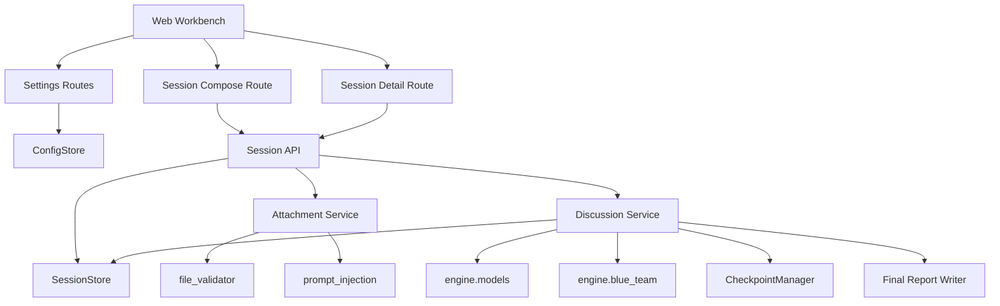

# RT 可视化 MVP 实现计划

## Overview

为 RT 增加单人可用的 Web 工作台 MVP，覆盖密钥配置、模型启用、角色模板微调、任务创建、附件上传、会议执行和结果查看。实现上优先复用现有 Python 引擎与安全边界，避免引入新的前后端分叉。

## Problem Frame

当前 RT 的核心能力集中在 CLI 中，配置、运行、观察、回看分散在命令行、环境变量和磁盘文件之间。要把 RT 推进成可直接操作的产品，首先需要一个最小可用的可视化层，但这个可视化层不能重新发明执行逻辑，也不能绕过已有的附件校验、Prompt 注入防护和日志脱敏。

这项工作是跨层改造，不只是“加一个页面”。真正的关键点有三件：
- 把当前耦合在 CLI 中的讨论流程抽成可复用的应用服务。
- 给 Web 层补齐可持久化的配置、会话快照和运行状态读模型。
- 用最小的前端技术栈交付完整闭环，而不是先搭一个重型前端工程。

## Requirements Trace

**工作台闭环**
- R1. 提供单人可用的一体化 Web 工作台。
- R2. 用户无需手改 `.env` 或命令行即可启动一次讨论。
- R3. Web 层复用现有 RT 引擎，不与 CLI 分叉。

**配置中心**
- R4. 提供 API Key 配置界面与连接状态。
- R4a. API Key 默认遮蔽显示，不回显完整明文。
- R5. 提供模型启用/禁用配置。
- R6. 配置完成后可直接进入会议编排。

**角色与会议编排**
- R7. 支持填写任务标题、任务描述和项目名。
- R8. 支持上传参考附件。
- R8a. 附件入口复用现有文件验证、Prompt 注入防护和数据分级边界。
- R9. 提供内置角色模板，并允许微调角色名称、职责说明、角色指令和绑定模型。
- R10. 用户可决定本次启用哪些角色。
- R10a. 会议启动时固化角色、模型、任务输入和附件清单快照。

**过程可视化**
- R11. 提供会议执行页，并以阶段级视图展示进展。
- R12. 展示当前阶段、已完成阶段、执行状态和阶段摘要。
- R13. 不展示角色逐条发言和底层调试信息。
- R13a. 失败或中断时展示失败阶段、原因摘要和下一步动作。

**结果查看**
- R14. 提供结果页展示最终报告和阶段摘要。
- R15. 结果页可回看模型配置、角色配置和附件清单。
- R16. MVP 结果页仅要求可读、可回看、可追溯，不支持编辑后再运行。

## Scope Boundaries

- 仅面向单人操作者，不做团队共享、权限控制和管理员分层。
- 过程可视化只做到阶段级，不展示角色逐条输出、重试细节、checkpoint 明细或原始 prompt。
- 角色仅支持基于内置模板做会前微调，不支持从零定义新的角色体系。
- 附件能力以“对本次任务提供参考上下文”为目标，不在本期引入完整知识库管理台。
- 不实现会议完成后的二次编辑复跑闭环。
- 不实现自动恢复长任务或多进程任务调度；MVP 默认单进程、本地或单机部署。

## Context & Research

### Relevant Code and Patterns

- `roundtable/config.py`
  当前所有模型 Key 都通过环境变量读取，并以模块级单例缓存。Web 化后如果继续沿用 `.env` 作为事实来源，需要补 `reload/reset` 能力。
- `roundtable/cli/main.py`
  现在的讨论流程直接写在 `RoundTableCLI` 中，阶段调用、Checkpoint 保存、成本记录和最终报告落盘都耦合在 CLI 层。Web MVP 的前提是先把这部分抽为应用服务。
- `roundtable/engine/structures.py`
  已有 `DiscussionEvent`、`Checkpoint`、`FinalReport` 等结构，适合继续作为会话审计和阶段结果的底层数据格式。
- `roundtable/engine/checkpoint.py`
  已有按会话和阶段保存 JSON 的能力，可继续承载阶段输出；但它不负责会话配置快照，也不提供适合 Web 页面的运行态摘要。
- `roundtable/utils/file_validator.py`
  已有扩展名、文件大小、魔法字节校验，适合直接复用于 Web 上传入口。
- `roundtable/utils/prompt_injection.py`
  已有检索上下文包裹和输入检测逻辑。MVP 的附件参考注入必须通过同一套安全封装进入 prompt。
- `roundtable/utils/logger.py`
  已有日志脱敏和审计模式。Key 配置和会话运行态接口需要继续走这套日志红线。

### Existing Direction Worth Preserving

- `roundtable-framework-v2 (1).md` 已将未来 Web UI 定位为 `FastAPI + Web` 界面，并强调过程可视化和文件上传。这一方向与当前需求一致。
- `roundtable/requirements.txt` 已包含 `fastapi` 和 `uvicorn`，说明在 Python 侧补 Web 层是顺势而为。

### Planned Divergence From Earlier Direction

- 原始框架文档提过 `Next.js + WebSocket`。本次 MVP 不沿用该前端方案，而是采用单进程 `FastAPI + 服务端模板 + 少量原生 JavaScript` 的方式落地。
- 原因是当前仓库没有 Node/前端工程，也没有现成的接口契约。若直接引入独立前端，会把 MVP 变成“先搭平台再做产品”。
- 这次偏离只适用于 MVP。退出条件是：一旦页面交互进入多视图复杂状态同步、细粒度流式输出、多人协作或需要独立前端部署，模板层应停止扩张并迁移到独立前端。为避免把过渡方案固化为长期方案，本期模板层不得承载复杂客户端状态管理、富文本编辑器或角色级实时消息流。

## Key Technical Decisions

| 决策 | 理由 |
|------|------|
| Web MVP 使用单进程 `FastAPI + Jinja2 模板 + 原生 JS` | 最小化技术栈，保持在现有 Python 仓库内完成闭环；后续仍可演进为独立前端 |
| Web 使用独立入口 `roundtable/web/app.py` | 避免把 CLI 与 Web 启动逻辑混在 `main.py` 中，便于部署、测试和边界管理 |
| 新增 `DiscussionService` 作为 CLI 与 Web 共用的应用服务层 | 解决 `RoundTableCLI` 与业务流程耦合的问题，满足 R3 |
| 配置采用双层存储：`.env` 保存 secrets，`settings.json` 保存 UI 配置 | 将 API Key 与模型启用、角色模板等产品配置分离，降低配置耦合 |
| 使用 `SessionStore` 保存会话快照和运行态摘要，Checkpoint 继续保存阶段产物 | 会话输入快照和阶段输出职责不同；结果页与执行页都需要稳定的读模型 |
| 运行中的会话始终使用启动时固化的配置快照 | 避免设置页在会话执行中途修改 Key、模型开关或角色模板后影响正在运行的任务 |
| 会议进度更新采用 HTTP 轮询而非 WebSocket | MVP 只展示阶段级状态，轮询更简单、风险更低、测试更直接 |
| 运行页与结果页共享同一个“会话详情”实体 | 同一会话从 `draft/running/completed/failed` 状态演化，避免双实体模型 |
| 附件采用“安全校验 + 本地持久化 + 文本提取后注入 prompt”的弱集成方案 | 先满足“有权威参考资料参与讨论”，不在 MVP 引入完整 RAG/Qdrant 编排 |
| 报告结果页先直接渲染 Markdown | 复用现有报告产物，避免在 MVP 中新增报告结构化渲染层 |
| 后台执行采用进程内任务注册器 | 比散落使用 `BackgroundTasks` 更可控，便于管理任务状态与中断语义 |
| 产品运行必须走真实讨论服务；测试可以使用 fake provider，但不提供面向用户的 mock 模式 | 避免 UI 与真实执行逻辑脱节 |

## Open Questions

### Resolved During Planning

- Web MVP 技术栈：使用 `FastAPI + Jinja2 模板 + 原生 JS`，不在本期引入 `Next.js`。
- Web 入口形态：使用独立入口 `roundtable/web/app.py`。
- 进度刷新机制：采用轮询读取会话状态，不上 WebSocket。
- 页面实体模型：运行中和已完成会话共用同一会话详情页，根据状态切换展示区块。
- 附件集成方式：MVP 采用弱集成，先做安全校验、保存和参考注入，不做完整知识库管理。
- 配置存储方式：`.env` 保存 secrets，`settings.json` 保存 UI 配置和模型/角色设置。
- 报告展示方式：结果页先直接渲染 Markdown。
- 后台任务方式：使用进程内任务注册器。
- 真实 API 与 UI 关系：界面逻辑最终接真实讨论服务；自动化测试使用 fake provider，不增加用户可见 mock 模式。

### Deferred to Implementation

- `.env` 受管写入的并发和回滚细节，是否需要临时文件替换。
- `settings.json` 的版本兼容与默认值迁移策略。
- 附件文本提取在不同文件类型上的上限控制和截断策略。
- 阶段摘要是否完全复用 `Checkpoint.metadata`，还是引入单独的会话状态字段。

## High-Level Technical Design

这部分用于说明总体结构，属于方向性设计，不是实现代码规范。



### Session Lifecycle

```text
设置 Key / 模型
  -> 创建会议草稿（任务 + 角色微调 + 附件）
  -> 固化会话快照
  -> 启动后台讨论任务
  -> 每阶段写入 Checkpoint + 更新 SessionStore 状态
  -> 前端轮询显示阶段状态
  -> 完成后在会话详情页展示报告、阶段摘要、配置快照和附件清单
```

## Implementation Units

- [ ] **Unit 1: 抽离可复用的讨论应用服务与会话存储**

**Goal:** 将当前耦合在 CLI 中的流程编排抽成 Web 和 CLI 可共享的应用服务，并为 Web 会话引入独立的快照/状态存储。

**Requirements:** R1, R3, R10a, R11, R12, R14, R15

**Dependencies:** 现有 `engine` 模块

**Files:**
- Create: `roundtable/engine/discussion_service.py`
- Create: `roundtable/engine/session_store.py`
- Modify: `roundtable/cli/main.py`
- Modify: `roundtable/engine/structures.py`
- Modify: `roundtable/engine/checkpoint.py`
- Test: `roundtable/tests/test_discussion_service.py`
- Test: `roundtable/tests/test_session_store.py`

**Approach:**
- 把 `RoundTableCLI.run_discussion()` 中的四阶段执行逻辑下沉到 `DiscussionService`。
- 在 `roundtable/engine/structures.py` 中定义 `SessionManifest` / `SessionStatus` 结构，保存任务输入、角色快照、模型快照、附件清单、当前阶段、阶段摘要、输出文件路径和错误摘要。
- 让 CLI 变成该服务的薄封装，避免未来 Web 修一处、CLI 再修一处。
- 保持 `CheckpointManager` 继续管理阶段输出 JSON，不让它承担页面读模型职责。
- `DiscussionService` 在会话启动时从全局配置生成不可变的运行时快照，后续阶段只读取该快照，不回读设置页最新值。

**Patterns to follow:**
- 复用 `engine/structures.py` 的 dataclass 风格。
- 复用 `engine/checkpoint.py` 的 JSON 文件落盘和原子写入思路。

**Test scenarios:**
- Happy path: 服务层能跑完整讨论并写入会话状态、Checkpoint 和最终报告。
- Edge case: 单阶段失败时会话状态标记为 `failed`，并记录失败阶段与错误摘要。
- Edge case: 会话启动后即使全局配置变化，运行态仍然使用启动时快照完成或失败。
- Integration: CLI 改为调用 `DiscussionService` 后，既有命令行为保持可用。

**Verification:**
- 不通过 CLI 也能从 `DiscussionService` 启动一次讨论任务。
- 会话目录中能看到配置快照和阶段状态文件。

- [ ] **Unit 2: 配置中心与双层配置存储**

**Goal:** 让用户通过界面配置 Key、模型启用状态和 UI 侧默认设置，并保持 secrets 与产品配置分离。

**Requirements:** R2, R4, R4a, R5, R6

**Dependencies:** Unit 1

**Files:**
- Create: `roundtable/web/services/config_store.py`
- Create: `roundtable/web/api/settings.py`
- Modify: `roundtable/config.py`
- Modify: `roundtable/requirements.txt`
- Test: `roundtable/tests/test_web_config_store.py`
- Test: `roundtable/tests/test_web_settings_api.py`

**Approach:**
- 引入 `ConfigStore`，分别管理受管 `.env` 和 `settings.json`。
- `.env` 只负责 API Key 等 secrets 的读写、遮蔽回显和连接测试。
- `settings.json` 负责模型启用状态、可供角色选择的模型目录、默认角色模板和其他 UI 配置。
- 为 `config.py` 增加显式的 `reload/reset` 入口，解决 secrets 更新后的运行态刷新问题。
- API 返回中只暴露 provider 状态、模型启用状态和是否已配置，不回显完整 secret。
- 设置页修改只影响后续新建会话；接口文档和服务实现都要明确，正在运行的会话不热切换到底层新配置。

**Patterns to follow:**
- 复用 `utils/logger.py` 的敏感信息脱敏。
- 保持 `config.py` 仍然是模型客户端唯一读取配置的入口。

**Test scenarios:**
- Happy path: 保存 Gemini/OpenRouter/DashScope Key 后，读取接口返回已配置状态和遮蔽后的展示值。
- Happy path: 保存模型启用状态和默认配置后，刷新页面仍能读到 `settings.json` 中的最新值。
- Edge case: 保存空 Key 时清除 provider 配置，不污染其他 provider。
- Error path: 写入非法配置或连接测试失败时返回可展示的错误摘要。
- Contract: 已启动会话读取的是历史快照，新配置仅影响之后创建的会话。
- Security: API 响应和日志中都不出现完整 Key。

**Verification:**
- 修改配置后无需重启进程即可被 `ModelClient` 读取。
- 设置页能在刷新后保持最新状态。

- [ ] **Unit 3: 任务编排、角色模板微调与附件入口**

**Goal:** 提供创建会议的 API 和服务，支持角色模板微调、模型绑定和安全附件上传。

**Requirements:** R7, R8, R8a, R9, R10, R10a

**Dependencies:** Unit 1, Unit 2

**Files:**
- Create: `roundtable/web/role_templates.py`
- Create: `roundtable/web/services/attachment_service.py`
- Create: `roundtable/web/api/sessions.py`
- Modify: `roundtable/utils/file_validator.py`
- Modify: `roundtable/utils/prompt_injection.py`
- Test: `roundtable/tests/test_attachment_service.py`
- Test: `roundtable/tests/test_web_session_creation_api.py`

**Approach:**
- 以内置角色模板作为来源，提供会前可编辑的会话副本，不把模板编辑变成全局提示词管理台。
- 设计 `CreateSessionRequest`，包含任务字段、启用角色、每个角色的名称/职责/指令/模型和附件引用。
- 附件上传流程先走扩展名、体积、魔法字节校验，再做文本提取与安全包裹，最后以清单形式写入会话快照。
- MVP 中附件上下文直接作为受控参考块注入讨论 prompt，完整 RAG 接入留到后续。
- 本期文本提取支持 `txt`、`md`、`pdf`、`docx`；`xlsx` 和 `pptx` 先允许上传进入清单，但默认不参与文本注入，避免在 MVP 中把文档解析做成主要风险源。
- 当可注入文件提取失败时，创建会话应阻断并给出明确错误；当文件属于“仅保留清单不注入”的类型时，会话可继续，但详情页需标明该附件未进入讨论上下文。

**Patterns to follow:**
- 复用 `utils/file_validator.py` 的验证函数。
- 复用 `utils/prompt_injection.py` 的上下文包裹和输入检测。

**Test scenarios:**
- Happy path: 创建会议时成功保存任务、角色快照和附件清单。
- Edge case: 某个角色绑定了被禁用模型时创建失败并返回明确错误。
- Edge case: `xlsx/pptx` 文件进入附件清单但不会进入 prompt，界面可回看该状态。
- Error path: 非法文件类型、超大文件或魔法字节不匹配时拒绝上传。
- Error path: `pdf/docx/txt/md` 提取失败时阻断创建并返回可执行错误信息。
- Security: 附件注入前必须经过安全封装，不能直接把原始文本拼到 prompt。

**Verification:**
- 创建会话后，`SessionStore` 中存在完整快照。
- 附件错误会在会前被阻断，而不是运行中才失败。

- [ ] **Unit 4: Web 会话 API、后台执行和阶段读模型**

**Goal:** 提供会话启动、状态轮询、结果读取和失败态反馈能力，使前端可以按阶段展示进展。

**Requirements:** R1, R10a, R11, R12, R13, R13a, R14, R15, R16

**Dependencies:** Unit 1, Unit 3

**Files:**
- Create: `roundtable/web/services/task_runner.py`
- Create: `roundtable/web/api/session_detail.py`
- Modify: `roundtable/engine/discussion_service.py`
- Modify: `roundtable/engine/session_store.py`
- Test: `roundtable/tests/test_web_session_status_api.py`
- Test: `roundtable/tests/test_web_task_runner.py`

**Approach:**
- 使用进程内后台任务注册表启动讨论任务，适配单人单机 MVP。
- 在每个阶段开始、结束、失败时更新 `SessionStore`，写入当前阶段、阶段摘要、错误摘要和建议动作。
- 提供只读接口：最近会话列表、会话详情、阶段状态、结果摘要、报告内容、附件清单、配置快照。
- 页面通过轮询读取状态，不暴露底层模型日志、事件流或 prompt。
- 若服务在会话运行中重启，进程内任务视为丢失；系统应在下次读取时将该会话标记为 `interrupted`，保留最近一次 Checkpoint、阶段摘要和“需重新发起或转入恢复流程”的下一步动作。

**Patterns to follow:**
- 阶段状态枚举尽量贴合现有 `Checkpoint.stage` 命名，减少映射复杂度。
- 复用 `DiscussionEvent` 记录关键状态变化，但不直接将事件日志暴露给前端。

**Test scenarios:**
- Happy path: 启动会话后能从 `queued/running` 过渡到 `completed`，并返回最终报告。
- Edge case: 进程内任务异常退出时，会话详情页看到 `failed` 状态、失败阶段和下一步动作。
- Edge case: 服务重启后，原运行中的会话变为 `interrupted`，并保留最近阶段数据。
- Integration: 阶段完成后接口返回的摘要与对应 Checkpoint 内容一致。
- Contract: 结果页读取的是启动时快照，而不是当前全局设置。

**Verification:**
- 刷新会话详情页不会丢失当前阶段信息。
- 已完成会话可重复访问并查看结果。

- [ ] **Unit 5: Web 工作台页面与最小交互实现**

**Goal:** 实现可直接操作的可视化工作台页面，覆盖设置、会议创建和会话详情三大场景。

**Requirements:** R1-R16

**Dependencies:** Unit 2, Unit 3, Unit 4

**Files:**
- Create: `roundtable/web/app.py`
- Create: `roundtable/web/templates/base.html`
- Create: `roundtable/web/templates/settings.html`
- Create: `roundtable/web/templates/session_new.html`
- Create: `roundtable/web/templates/session_detail.html`
- Create: `roundtable/web/static/app.css`
- Create: `roundtable/web/static/app.js`
- Modify: `roundtable/main.py`
- Test: `roundtable/tests/test_web_pages.py`

**Approach:**
- 提供一个简洁单人工作台：顶部导航或侧栏进入“设置”“新建会议”“最近会话”。
- 设置页展示 provider 状态、Key 编辑入口和模型启用开关。
- 新建会议页展示任务表单、附件上传区、角色模板卡片和模型绑定选择器。
- 会话详情页根据状态显示阶段时间线、当前阶段摘要、失败提示、最终报告和配置回看区块。
- 最近会话列表使用 `SessionStore` 的摘要读模型，最小字段集至少包含 `session_id`、标题、状态、当前/最后阶段、更新时间和结果入口。
- 前端交互仅使用少量原生 JS 处理表单提交、轮询和局部状态刷新。
- Web 应用通过独立入口 `roundtable/web/app.py` 暴露 ASGI `app`，CLI 入口继续保留在 `roundtable/main.py`。

**Patterns to follow:**
- 保持 HTML 结构和接口契约简单明确，避免在 MVP 引入前端状态管理框架。
- 视觉上优先强调“阶段推进”和“配置可追溯”，而不是复杂数据密度。

**Test scenarios:**
- Happy path: 页面路由可访问，表单能驱动创建、启动和查看会话。
- Edge case: 未配置任何可用模型时，新建会议页给出阻断提示。
- Error path: 附件上传失败、会话启动失败、会话执行失败都能显示人能理解的反馈。
- Accessibility: 关键表单控件和状态标签在无脚本场景下至少可读。

**Verification:**
- 用户可从浏览器完成一次完整闭环，不需要打开终端。
- 会话执行页能看到阶段级推进，并在完成后看到结果回看区块。

- [ ] **Unit 6: 端到端收口、文档更新与发布准备**

**Goal:** 补齐最小集成验证、使用文档和项目状态更新，确保 Web MVP 有可交付说明。

**Requirements:** R1-R16

**Dependencies:** Unit 1-5

**Files:**
- Modify: `roundtable/README.md`
- Modify: `roundtable/docs/PROGRESS.md`
- Modify: `roundtable/requirements.txt`
- Test: `roundtable/tests/test_web_e2e.py`

**Approach:**
- 增加基于 `FastAPI TestClient` 的端到端测试，覆盖设置、创建会话、轮询完成和结果读取。
- 更新 README，说明如何启动 Web 应用、如何配置 Key、如何运行 MVP。
- 更新进度文档，明确 CLI 与 Web 的完成范围和剩余缺口。
- 如果真实 provider 仍未稳定，测试中继续使用 fake provider，但交付验收要求至少一条真实 provider 路径可手工打通。

**Patterns to follow:**
- 沿用当前项目以 Python 测试为主的验证方式，不在本期引入浏览器测试框架。

**Test scenarios:**
- Happy path: 从保存配置到完成一次会话的测试流程全部通过。
- Edge case: 无附件、单角色、单可用模型时依然可以完成最小讨论。
- Integration: Web 生成的报告文件与 CLI 生成格式保持兼容。
- Regression: 既有 CLI 命令仍可运行并复用相同讨论服务。

**Verification:**
- 文档覆盖本地运行和基本排障。
- 项目状态文档能准确反映 Web MVP 已完成的部分与后续工作。

## System-Wide Impact

- **Execution architecture:** 现有“CLI 直接编排 engine”的结构会变成“CLI/Web 都调用 `DiscussionService`”，这是本次最大的边界调整。
- **Configuration lifecycle:** 当前配置单例缓存必须支持重载，否则 Web 改 Key 后运行态和设置页会不一致。
- **Security boundary parity:** Web 上传、日志、配置接口都必须继承 CLI/P0 的安全约束，不能新增明文 secret 泄露面。
- **Persistence model:** 除了已有 Checkpoint，还将新增会话快照与状态存储；这会成为结果页和最近会话列表的数据来源。
- **Entry-point surface:** Web 使用独立 `roundtable/web/app.py` 入口，CLI 继续使用 `roundtable/main.py`，两者共享服务层而不共享启动逻辑。
- **Failure propagation:** 后台任务异常不能只写日志，必须转成会话状态供前端读取。
- **Restart semantics:** 由于 MVP 使用进程内后台任务，服务重启后的运行中会话必须可见地转为 `interrupted`，不能静默丢失。

## Risks & Dependencies

| Risk | Mitigation |
|------|------------|
| Web 直接调用现有 CLI 逻辑导致重复代码和行为漂移 | 先抽 `DiscussionService`，再接 Web |
| 配置写入后因单例缓存不生效 | 为 `config.py` 引入 reset/reload，并在 secrets 保存后显式刷新 |
| `.env` 与 `settings.json` 职责混淆 | 明确 `.env` 只存 secrets，`settings.json` 只存 UI 配置，并在代码中分层读取 |
| 运行中的会话受设置页后续修改影响 | 会话启动时固化配置快照，运行态只读快照 |
| Key 在接口、模板或日志中泄露 | API 返回遮蔽值，日志继续走脱敏过滤，前端不展示完整 secret |
| 附件上传绕过现有安全防护 | 统一通过 `AttachmentService` 调用 `file_validator` 和 `prompt_injection` |
| 附件提取成为 MVP 主要不稳定源 | 缩小可注入文件类型范围，并为不支持类型定义“只保留清单”的降级 |
| 进程内后台任务模型在服务重启时丢失 | MVP 明确不做自动恢复；中断状态在详情页中可见，并保留 checkpoint |
| 结果页回看内容与启动时配置不一致 | 会话启动时固化快照，不从当前全局设置反查 |
| 引入独立前端工程拉长交付周期 | MVP 使用模板和轻量 JS，推迟独立前端化 |

## Documentation / Operational Notes

- Web MVP 需要在 `requirements.txt` 中补充 `jinja2`、`python-multipart` 等 Web 表单和模板依赖。
- 建议新增 `data/sessions/` 目录保存会话清单、运行态和附件元数据；`data/checkpoints/` 继续保存阶段产物。
- README 需要说明 `.env` 由 UI 管理 secrets，`settings.json` 保存产品配置，用户通常无需手工编辑二者。
- `.env` 与 `settings.json` 都只是本期本地存储后端，不视为长期架构承诺；如果后续演进为远程部署或多用户服务，应迁移到独立配置存储。
- 真实验收至少需要一条 provider 路径能手工打通，否则只能算“界面闭环已完成，真实执行待验证”。

## Sources & References

- **Origin requirements:** [2026-04-01-rt-visual-mvp-requirements.md](D:/worksapces/RT/docs/brainstorms/2026-04-01-rt-visual-mvp-requirements.md)
- **Existing plan:** [2026-03-30-001-feat-roundtable-cli-mvp-plan.md](D:/worksapces/RT/docs/plans/2026-03-30-001-feat-roundtable-cli-mvp-plan.md)
- **Progress record:** [PROGRESS.md](D:/worksapces/RT/roundtable/docs/PROGRESS.md)
- **Framework direction:** [roundtable-framework-v2 (1).md](D:/worksapces/RT/roundtable-framework-v2%20(1).md)
